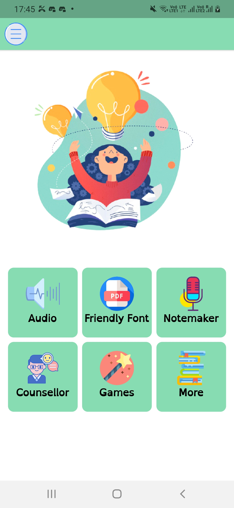
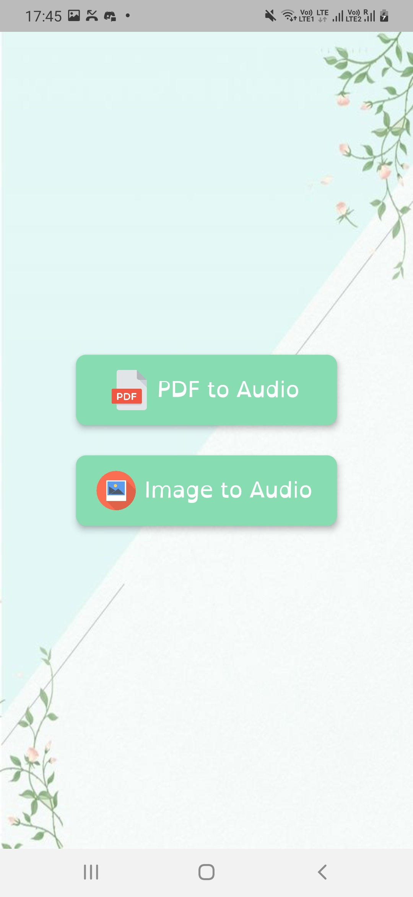
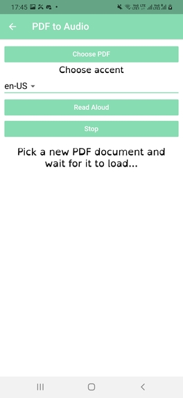
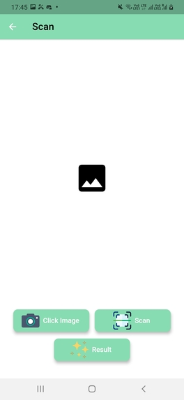
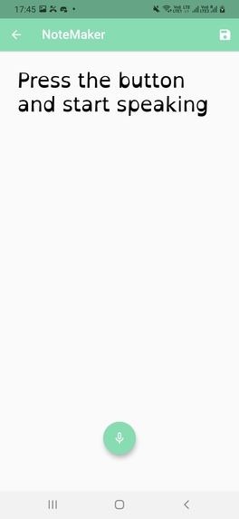

# Learnify

Globally, according to Dyslexia International(2017) between 5-10% of the population experience dyslexia, which equates to around 700 million people worldwide. There are many problems like reading, writing, memory, and organizational difficulties that they face which makes day-to-day life difficult. Due to Covid, it has been difficult for all students to transition to online classes and we can imagine how difficult it would have been for kids with learning disabilities. Parents working from home can not give proper time to kids and help them with their studies. It's tough for teachers as well to have 1-1 interaction with kids and give them the attention they need. This all is affecting the learning experience for a lot of kids worldwide and making the lives of kids with learning disabilities miserable.

## What it does?

It has tools to ease life of students by providing following features :

- PDF/Image to audio: This feature helps in converting pdf and image to audio which helps kids in learning the correct pronunciation and it can also be used for reading aloud stories for younger kids.

- Friendly Font: It allows users to convert PDF's font to open dyslexic, a dyslexia friendly font that makes it easy for kids to go through reading material given to them during online classes.

- Notemaker : Students can use this feature to make notes and also keep mic on next to their online class so that they don't miss out on what the teacher is saying

- Games : Memory retention game

- Counsellor : To connect with a counsellor and talk about problems

## Screenshots

<pre>
    
</pre>
